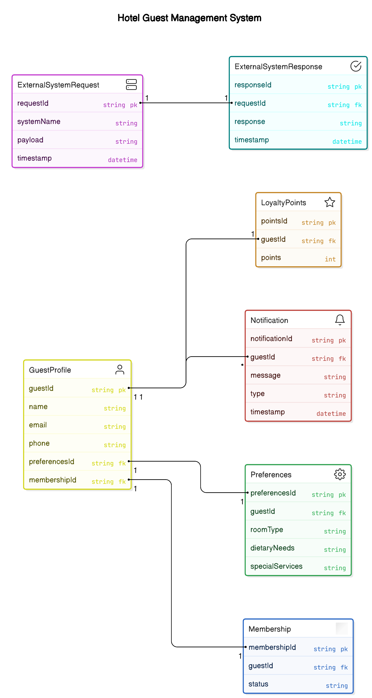

Sure, let's describe how the Entity-Relationship (ER) diagram for the Guest Management bounded context will look like based on the updated microservice architecture.

### ER Diagram Description

#### Entities and Relationships

1. **GuestProfile**
   - **Attributes**:
     - `guestId` (Primary Key)
     - `name`
     - `email`
     - `phone`
     - `preferencesId` (Foreign Key)
     - `membershipId` (Foreign Key)
   - **Relationships**:
     - One-to-One with **Preferences** (via `preferencesId`)
     - One-to-One with **Membership** (via `membershipId`)

2. **Preferences**
   - **Attributes**:
     - `preferencesId` (Primary Key)
     - `guestId` (Foreign Key)
     - `roomType`
     - `dietaryNeeds`
     - `specialServices`
   - **Relationships**:
     - One-to-One with **GuestProfile** (via `guestId`)

3. **LoyaltyPoints**
   - **Attributes**:
     - `pointsId` (Primary Key)
     - `guestId` (Foreign Key)
     - `points`
   - **Relationships**:
     - One-to-One with **GuestProfile** (via `guestId`)

4. **Membership**
   - **Attributes**:
     - `membershipId` (Primary Key)
     - `guestId` (Foreign Key)
     - `status`
   - **Relationships**:
     - One-to-One with **GuestProfile** (via `guestId`)

5. **Notification**
   - **Attributes**:
     - `notificationId` (Primary Key)
     - `guestId` (Foreign Key)
     - `message`
     - `type`
     - `timestamp`
   - **Relationships**:
     - Many-to-One with **GuestProfile** (via `guestId`)

6. **ExternalSystemRequest**
   - **Attributes**:
     - `requestId` (Primary Key)
     - `systemName`
     - `payload`
     - `timestamp`
   - **Relationships**:
     - None (standalone entity)

7. **ExternalSystemResponse**
   - **Attributes**:
     - `responseId` (Primary Key)
     - `requestId` (Foreign Key)
     - `response`
     - `timestamp`
   - **Relationships**:
     - One-to-One with **ExternalSystemRequest** (via `requestId`)

### Diagram Layout

- **GuestProfile** is the central entity, connected to **Preferences**, **LoyaltyPoints**, and **Membership** through one-to-one relationships.
- **Preferences** and **Membership** are directly linked to **GuestProfile**.
- **LoyaltyPoints** is linked to **GuestProfile** through a one-to-one relationship.
- **Notification** has a many-to-one relationship with **GuestProfile**, indicating that a guest can have multiple notifications.
- **ExternalSystemRequest** and **ExternalSystemResponse** are standalone entities with a one-to-one relationship between them.

### Visual Representation

Here's a simplified textual representation of the ER diagram:

```
GuestProfile
  |-- preferencesId --> Preferences
  |-- membershipId --> Membership
  |-- guestId --> LoyaltyPoints
  |-- guestId --> Notification (One-to-Many)

ExternalSystemRequest
  |-- requestId --> ExternalSystemResponse
```

