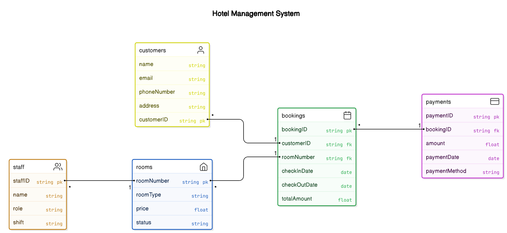

## Class Diagrams for a Hotel Management System.

Class diagrams are a type of static structure diagram that describe the structure of a system by showing its classes, attributes, methods, and the relationships among objects.

**Key Classes and Their Details**

**Customer**

 - Attributes: customerID, name, email, phoneNumber, address
 - Methods: register(), updateProfile(), viewBookingHistory()

**Room**

 - Attributes: roomNumber, roomType, price, status
 - Methods: checkAvailability(), updateStatus(), calculatePrice()

**Booking**

 - Attributes: bookingID, customerID, roomNumber, checkInDate,
   checkOutDate, totalAmount
 - Methods: createBooking(), cancelBooking(), modifyBooking()

  **Payment**

 - Attributes: paymentID, bookingID, amount, paymentDate, paymentMethod
 - Methods: processPayment(), refundPayment(), generateReceipt()

**Staff**

 - Attributes: staffID, name, role, shift
 - Methods: assignTask(), updateShift(), viewTasks()

**Interactions**

 - Customer and Booking: Customers can create, modify, or cancel
   bookings.   
 - Booking and Room: Bookings check room availability and update room   
   status.
 - Booking and Payment: Bookings process payments.
 - Staff and Room: Staff update room status and assign housekeeping   
   tasks.

