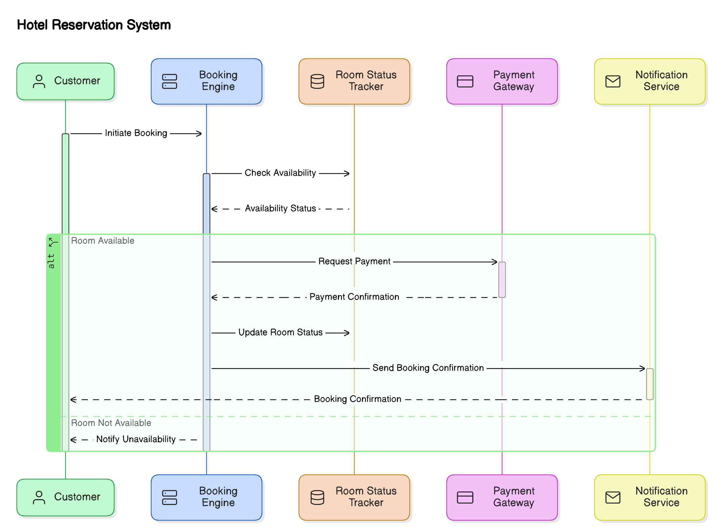

## Sequence diagrams

Sequence diagrams shows interactions during booking and check-in processes, state diagrams

**Components Involved:**

 - Customer: Initiates the booking process.
 - Booking Engine: Manages the booking process.
 - Payment Gateway: Processes the payment.
 - Notification Service: Sends booking confirmations.

**Sequence of Interactions:**

 - Customer Initiates Booking: The customer selects a room and sends a
   booking request to the Booking Engine.

 - Booking Engine Checks Availability: The Booking Engine queries the
   Room Status Tracker for room availability.

 - Room Status Tracker Responds: The Room Status Tracker provides the
   availability status.

 - Booking Engine Confirms Availability: If available, the Booking
   Engine proceeds to payment.

 - Booking Engine Requests Payment: The Booking Engine sends a payment
   request to the Payment Gateway.

 - Payment Gateway Processes Payment: The Payment Gateway processes the
   payment and confirms it to the Booking Engine.

 - Booking Engine Confirms Booking: The Booking Engine confirms the
   booking and updates the Room Status Tracker.

 - Booking Engine Sends Notification: The Booking Engine sends a booking
   confirmation to the Notification Service.

 - Notification Service Sends Confirmation: The Notification Service
   sends a booking confirmation to the customer.

