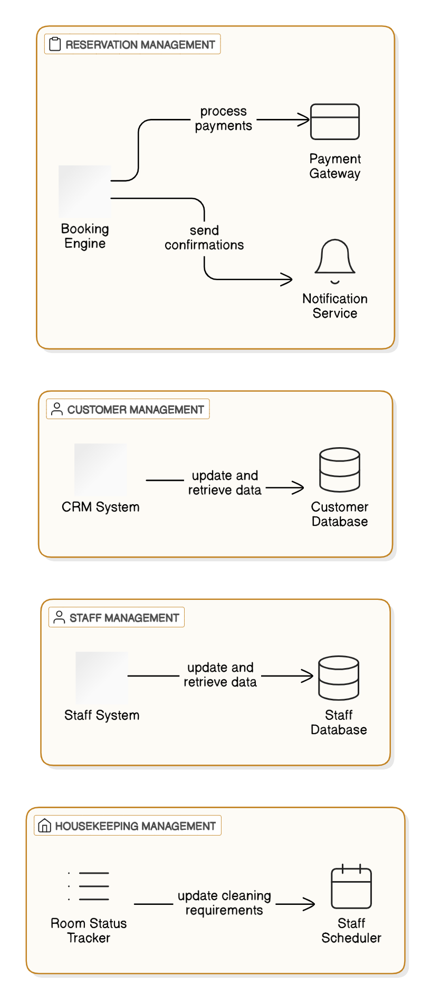

## Component Diagrams

This shows the structure of the system, including all software components and their relationships.  

**Reservation System**: Manages bookings, cancellations, and modifications. 

 - Components: Booking Engine, Payment Gateway, Notification Service.
 - Interactions: Booking Engine interacts with the Payment Gateway to
   process payments and the Notification Service to send booking
   confirmations.

**Customer Management**: Handles customer data, preferences, and history. 

 - Components: Customer Database, CRM System.

 - Interactions: CRM System updates the Customer Database with new
   information and retrieves customer history for personalized service.

**Housekeeping Management**: Tracks room status, cleaning schedules, and staff assignments.

 - Components: Room Status Tracker, Staff Scheduler. Interactions: Room
   Status Tracker updates the Staff Scheduler with room cleaning
   requirements.

