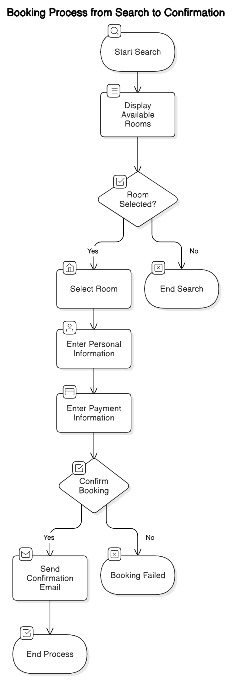

Business Process Models:
Description: Diagrams showing the booking process from search to confirmation.
Example:
Steps:
Guest searches for available rooms.
System displays available rooms.
Guest selects a room and proceeds to booking.
Guest enters personal and payment information.
System confirms the booking and sends a confirmation email.

