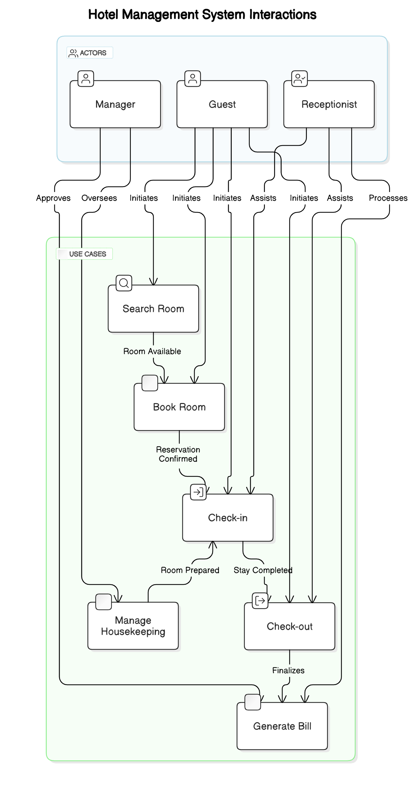

Use Case Diagrams:
Description: Illustrating interactions between guests, hotel staff, and the system.
Example:
Actors: Guest, Receptionist, Manager.
Use Cases: Search Room, Book Room, Check-in, Check-out, Manage Housekeeping, Generate Bill.

