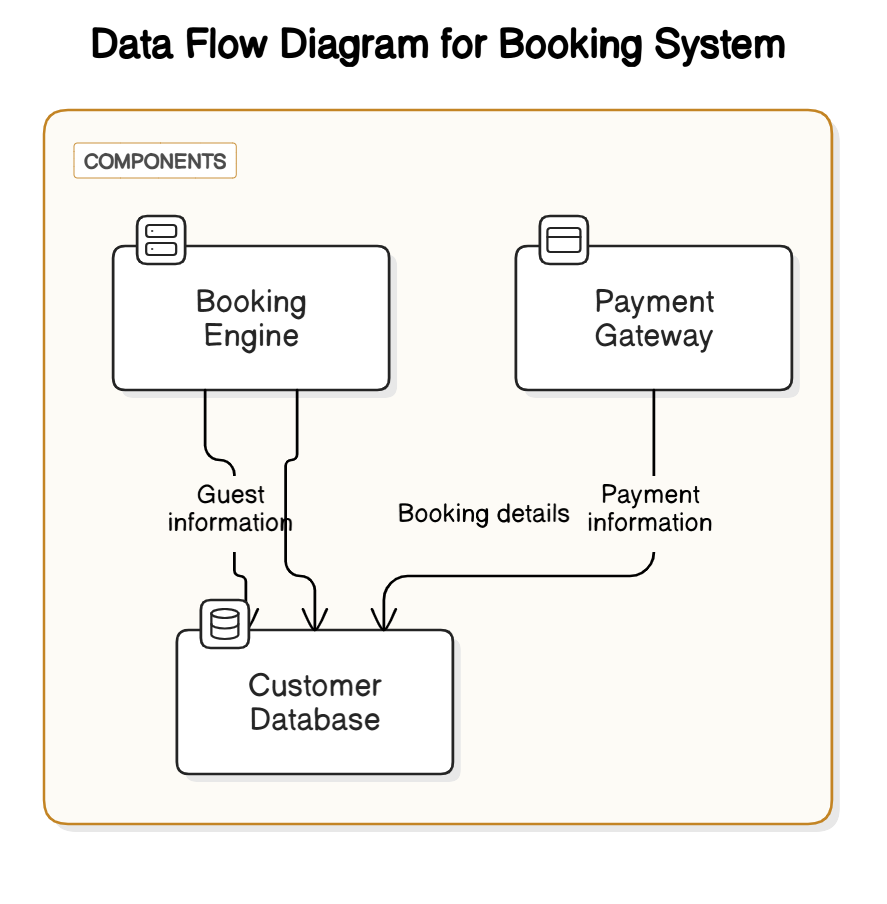

Data Flow Diagrams:
Description: Illustrating how data moves between components like the booking engine, customer database, and payment gateway.
Example:
Processes:
Booking Engine: Handles room search and booking requests.
Customer Database: Stores guest information and booking details.
Payment Gateway: Processes payment transactions.
Data Flows:
Guest information flows from the Booking Engine to the Customer Database.
Booking details flow from the Booking Engine to the Customer Database.
Payment information flows from the Payment Gateway to the Customer Database.

