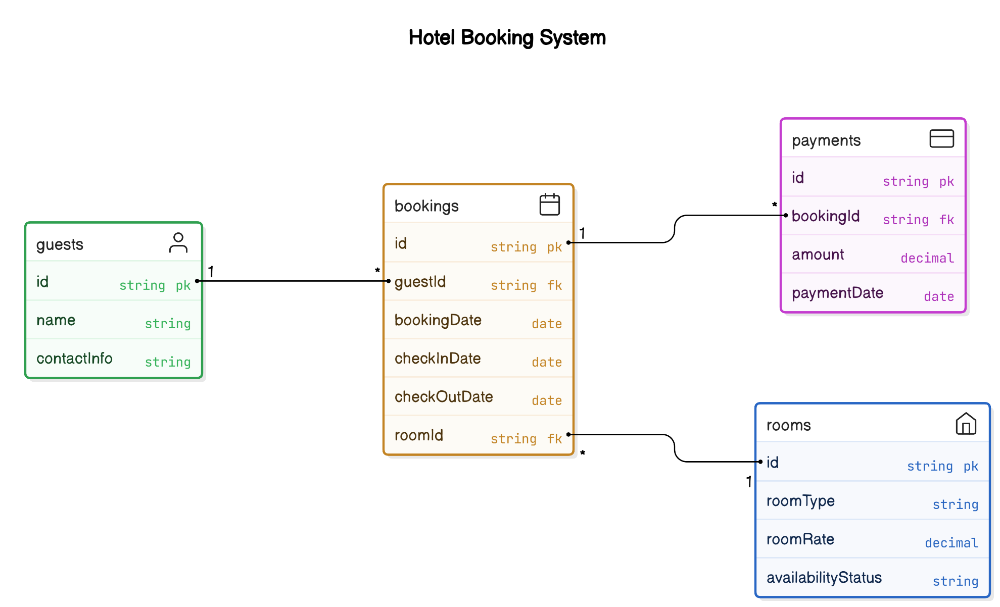

Data Models:
Description: Entity-relationship diagrams representing guests, bookings, payments, and room details.
Example:
Entities:
Guest: Attributes include GuestID, Name, ContactInfo.
Booking: Attributes include BookingID, GuestID, RoomID, BookingDate, CheckInDate, CheckOutDate.
Payment: Attributes include PaymentID, BookingID, Amount, PaymentDate.
Room: Attributes include RoomID, RoomType, RoomRate, AvailabilityStatus.
Relationships:
A Guest can have multiple Bookings.
A Booking is associated with one Room.
A Booking can have multiple Payments.

